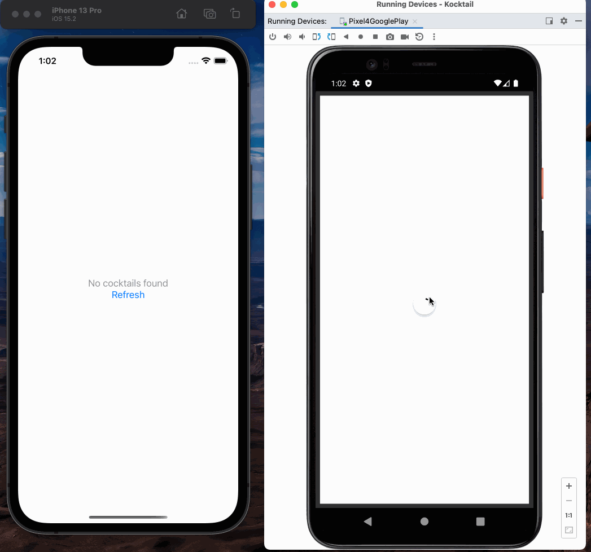

# Kocktail 
Cocktail Directory App made with [Kotlin Multiplatform Mobile](https://kotlinlang.org/lp/mobile/)

## Preview


## Libraries Used 

- [Kotlinx Coroutines](https://github.com/Kotlin/kotlinx.coroutines)
  - [KMP-NativeCoroutines](https://github.com/rickclephas/KMP-NativeCoroutines)  
    This makes it possible to use `StateFlow` on iOS 
- [Jetpack Viewmodel](https://developer.android.com/topic/libraries/architecture/viewmodel)
  - [KMM-ViewModel](https://github.com/rickclephas/KMM-ViewModel)   
    This makes it possible to write common `ViewModel` code for iOS and Android
- [Ktor](https://ktor.io/docs/create-client.html)  
  Using `OkHttp` engine for Android and `Darwin` engine for iOS
- [Kotlinx Serialization](https://github.com/Kotlin/kotlinx.serialization)

## Code Overview 

### Shared ViewModel

```kotlin
class CocktailListViewModel : KMMViewModel() {
    private val api = CocktailAPI()

    private val _cocktailState = MutableStateFlow<CocktailListState>(CocktailListState.Empty)

    @NativeCoroutinesState
    val cocktailState: StateFlow<CocktailListState> = _cocktailState.stateIn(
        viewModelScope, SharingStarted.WhileSubscribed(), CocktailListState.Empty
    )

    fun updateCocktailList() {
        _cocktailState.value = CocktailListState.Loading
        viewModelScope.coroutineScope.launch {
            try {
                val response = api.getCocktails()
                _cocktailState.value = CocktailListState.Success(response)
            } catch (e: Exception) {
                _cocktailState.value = CocktailListState.Error(e)
            }
        }
    }
}
```

### iOS View 

#### `CocktailItemRowView` - view to render each list item 
<details>
<summary>View Code</summary>

```swift
struct CocktailItemRowView: View {
    var drink: Drink
    var body: some View {
        HStack {
            Text(drink.strDrink!)
                    .font(.title)
                    .bold()
                    .padding(10)
            Spacer()
            Text((drink.strIngredient1 ?? "") + "," + (drink.strIngredient2 ?? ""))
                    .font(.caption)
                    .padding(10)
            Spacer()
            Text(drink.strCategory!)
                    .font(.body)
                    .foregroundColor(.gray)
                    .padding(10)
        }
    }
}
```
</details>

#### `CocktailListView` - view for rendering the list (or errors/loading)
<details>
<summary>View Code</summary>

```swift
struct CocktailListView: View {
    var state: CocktailListState
    var onRefresh: () -> Void

    var body: some View {
        VStack {
            switch state {
            case is CocktailListState.Error:
                Text((state as! CocktailListState.Error).error.message ?? "Error")
                        .foregroundColor(.red);
            case is CocktailListState.Empty:
                VStack {
                    Text("No cocktails found")
                            .foregroundColor(.gray)
                    Button(action: onRefresh) {
                        Text("Refresh")
                    }
                }
            case is CocktailListState.Loading:
                ProgressView()
            case is CocktailListState.Success:
                List((state as! CocktailListState.Success).cocktails.drinks, id: \.idDrink) { drink in
                    CocktailItemRowView(drink: drink)
                }
            default:
                Text("Unknown state")
            }

        }
    }
}

```
</details>

#### `ContentView` - main screen of the app 

<details>
<summary>View Code</summary>

```swift
struct ContentView: View {
	@ObservedViewModel var viewModel = CocktailListViewModel()

	var body: some View {
		CocktailListView(state: viewModel.cocktailState, onRefresh: {
			viewModel.updateCocktailList()
		})
	}
}
``` 
</details>


### Android View 

#### `CocktailItemRowView` - view to render each list item

<details>
<summary>View Code</summary>

```kotlin
@Composable
fun CocktailItemRowView(drink: Drink) {
    Surface(
        modifier = Modifier
            .fillMaxWidth()
            .padding(4.dp),
        elevation = 4.dp,
    ) {
        Row(
            verticalAlignment = Alignment.CenterVertically,
        ) {
            Text(
                text = drink.strDrink ?: "", Modifier.padding(12.dp),
                style = KocktailUIConfig.typography().subtitle1
            )
            Column(
                modifier = Modifier.weight(1f),
            ) {
                Text(
                    text = arrayOf(
                        drink.strIngredient1,
                        drink.strIngredient2,
                        drink.strIngredient3
                    ).joinToString(",") { it ?: "" },
                    Modifier.padding(12.dp),
                    style = KocktailUIConfig.typography().caption,
                )
            }
            Text(
                text = drink.strCategory ?: "", Modifier.padding(12.dp),
                style = KocktailUIConfig.typography().subtitle2
            )
        }
    }
}
```
</details>

#### `CocktailListView` - view for rendering the list (or errors/loading)
> \* includes **Pull to Refresh** functionality

<details>
<summary>View Code</summary>

```kotlin
@OptIn(ExperimentalMaterialApi::class)
@Composable
fun CocktailListView(
    state: CocktailListState,
    onRefresh: () -> Unit,
    pullRefreshState: PullRefreshState = rememberPullRefreshState(
        refreshing = state is CocktailListState.Loading,
        onRefresh = onRefresh
    ),
) {
    Box(
        modifier = Modifier
            .fillMaxSize()
            .pullRefresh(
                state = pullRefreshState,
                enabled = true
            )
    ) {
        when (state) {
            is CocktailListState.Success -> {
                LazyColumn {
                    items(
                        items = state.cocktails.drinks,
                        itemContent = { CocktailItemRowView(drink = it) },
                        key = { it.idDrink!! },
                    )
                }

            }

            is CocktailListState.Error -> {
                Text(text = "Error: ${state.error.message}")
            }

            CocktailListState.Loading -> {
                PullRefreshIndicator(
                    modifier = Modifier.align(Alignment.Center),
                    refreshing = true,
                    state = pullRefreshState
                )
            }

            CocktailListState.Empty -> {
                Button(
                    onClick = onRefresh,
                    modifier = Modifier.align(Alignment.Center)
                ) {
                    Text(text = "Tap to refresh")
                }
            }
        }
    }
}
```
</details>

#### `MainActivity` - main screen of the app

<details>
<summary>View Code</summary>

```kotlin
class MainActivity : ComponentActivity() {
    val viewModel: CocktailListViewModel by viewModels()
    override fun onCreate(savedInstanceState: Bundle?) {
        super.onCreate(savedInstanceState)
        setContent {
            KocktailUIConfig.Theme {
                val state = viewModel.cocktailState.collectAsState()
                CocktailListView(
                    state = state.value,
                    onRefresh = { viewModel.updateCocktailList() }
                )
            }
        }
    }
}

```
</details>